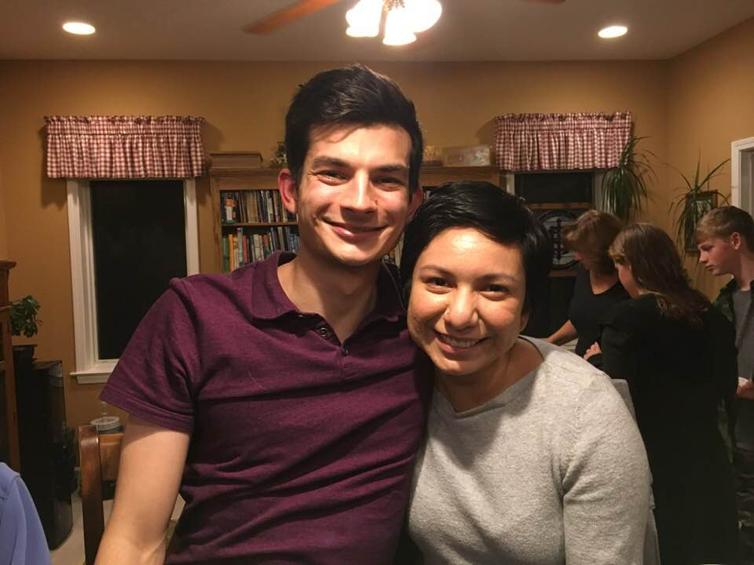
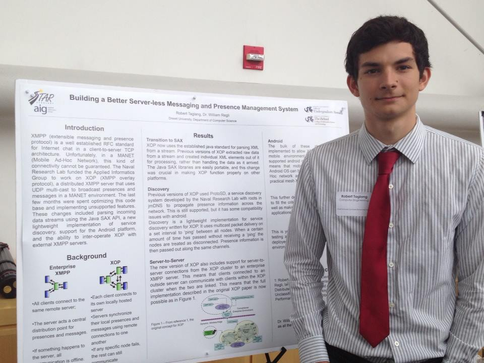
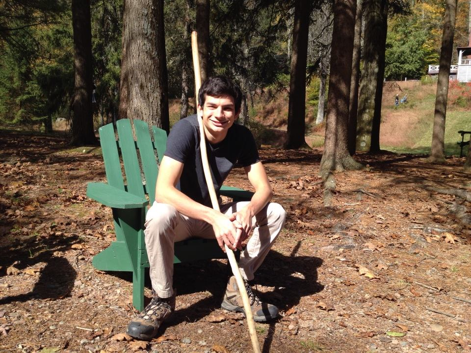

# About Me

<b-container fluid>
<b-row>
<b-col cols="7">

My name is Rob Taglang. You can find me as 
[@lasalvavida](https://github.com/lasalvavida)
on GitHub.

## Work

I work at
[Private Machines Inc.](https://privatemachines.com)
in Brooklyn, NY as a software developer.

## Open Source

I maintain the Khronos Group
[COLLADA2GLTF](https://github.com/KhronosGroup/COLLADA2GLTF)
project for converting 3D COLLADA (DAE) models to
[glTF](https://www.khronos.org/gltf).

I am also an independent member of the Khronos Group 3D formats working group.

## School

I graduated from Drexel University in June 2017, BS/MS in Computer Engineering.

The thesis and its accompanying work are all open-source. Current drafts and LaTeX sources are available on 
[GitHub](https://github.com/lasalvavida/thesis-draft).

And the FPGA IP block sources can be found as the
[Zybo Open Source Video IP Toolbox](https://github.com/lasalvavida/Zybo-Open-Source-Video-IP-Toolbox)

## Contact
[<v-icon name="envelope"/> rob@taglang.io](mailto:rob@taglang.io)
 
[<v-icon name="brands/github"/> @lasalvavida](https://github.com/lasalvavida)
 
[<v-icon name="file"/> Resume](/resume.pdf)

</b-col>
<b-col cols="5">

</b-col>
</b-row>
</b-container>

