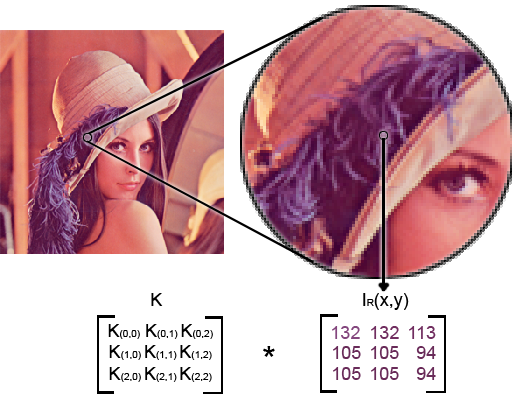

# {{ $page.frontmatter.title }}

**{{ new Date($page.frontmatter.date).toDateString() }}**

In my previous post, I included a simple kernel convolution sandbox that uses
[VisionJS](https://github.com/lasalvavida/visionjs)
to generate kernels and apply them to the classic Lenna test image.

*Note: this is done on the CPU of your machine; it does not use server-side processing.
At some point, I may do a WebGL GPU implementation with a speed comparison.*

The mathematical definition of a convolution is
.
This is a formal way of describing sliding one signal across another
and computing their overlapping area at each position.
If this isn't clear, Wolfram MathWorld has a terrific article on
[convolution](http://mathworld.wolfram.com/Convolution.html)
that is probably worth the time to look at.

So, how do we apply an abstract mathematical concept to something like an image?
First we need to put the image in terms that can be used for computation.
A very common way of storing image data is in a 24-bit RGB format. That means
that we have split up a composite image into its red, green, and blue light components.
When combined, we get the whole image.

Each component is stored as 8 bits, or [0-255]. For computation, we can treat the image
like a set of three separate *m x n* matrices all with values on the range [0-255].
We'll refer to these separate matrices as channels.

The convolution definition above describes the theoretical process for one-dimensional
continous signals. In the case of image processing, our input data is two-dimensional
and discrete. Because of this, it may be helpful to think of convolution as a way of
relating pixels spatially with their neighbors. Let *K* be our convolution kernel,
a matrix of size *3 x 3*. At each pixel, we take the *3 x 3* of pixels on each
channel around our selection,

where
.

   
Each pixel value is multiplied by its corresponding kernel value, and the sum is stored
on the selected pixel. The kernel values map to mirrored pixel values.
(e.g.

gets multiplied by
.
  
This operation can be written mathematically as
.

<BlogPostNav/>

